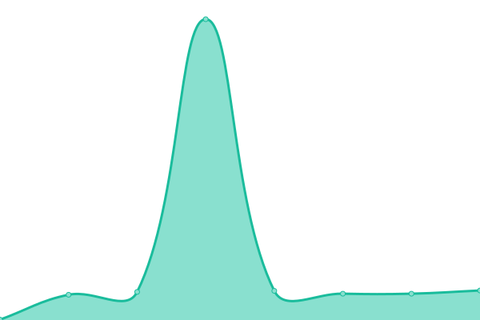
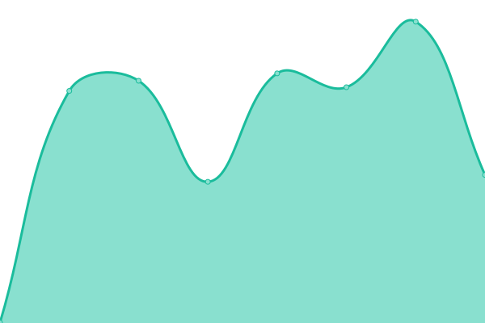
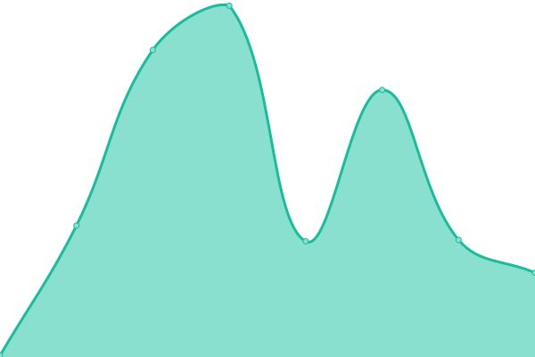
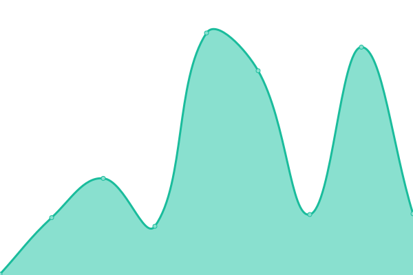
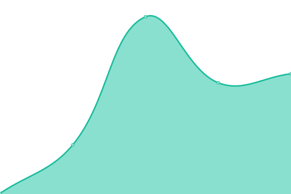

# [📈 Live Status](https://RafaelPereiraa.github.io/Teste-upptime): <!--live status--> **🟧 Partial outage**

This repository contains the open-source uptime monitor and status page for [RafaelPereiraa](https://RafaelPereiraa.github.io/Teste-upptime), powered by [Upptime](https://github.com/upptime/upptime).

With [Upptime](https://upptime.js.org), you can get your own unlimited and free uptime monitor and status page, powered entirely by a GitHub repository. We use [Issues](https://github.com/RafaelPereiraa/Teste-upptime/issues) as incident reports, [Actions](https://github.com/RafaelPereiraa/Teste-upptime/actions) as uptime monitors, and [Pages](https://RafaelPereiraa.github.io/Teste-upptime) for the status page.

<!--start: status pages-->
<!-- This summary is generated by Upptime (https://github.com/upptime/upptime) -->
<!-- Do not edit this manually, your changes will be overwritten -->
<!-- prettier-ignore -->
| URL | Status | History | Response Time | Uptime |
| --- | ------ | ------- | ------------- | ------ |
|  [Google](https://www.google.com) | 🟩 Up | [google.yml](https://github.com/RafaelPereiraa/Teste-upptime/commits/HEAD/history/google.yml) | 

 197ms
     
 | 

<a href="https://RafaelPereiraa.github.io/Teste-upptime/history/google">99.67%</a>
    

|  SRV01 | 🟩 Up | [srv-01.yml](https://github.com/RafaelPereiraa/Teste-upptime/commits/HEAD/history/srv-01.yml) | 

 418ms
     
 | 

<a href="https://RafaelPereiraa.github.io/Teste-upptime/history/srv-01">100.00%</a>
    

|  SRV02 | 🟥 Down | [srv-02.yml](https://github.com/RafaelPereiraa/Teste-upptime/commits/HEAD/history/srv-02.yml) | 

 0ms
     
 | 

<a href="https://RafaelPereiraa.github.io/Teste-upptime/history/srv-02">0.00%</a>
    

|  SRV04 | 🟩 Up | [srv-04.yml](https://github.com/RafaelPereiraa/Teste-upptime/commits/HEAD/history/srv-04.yml) | 

 501ms
     
 | 

<a href="https://RafaelPereiraa.github.io/Teste-upptime/history/srv-04">100.00%</a>
    

|  SRV05 | 🟩 Up | [srv-05.yml](https://github.com/RafaelPereiraa/Teste-upptime/commits/HEAD/history/srv-05.yml) | 

 504ms
     
 | 

<a href="https://RafaelPereiraa.github.io/Teste-upptime/history/srv-05">100.00%</a>
    

|  ROCKET_KPLATZ_101 | 🟥 Down | [rocket-kplatz-101.yml](https://github.com/RafaelPereiraa/Teste-upptime/commits/HEAD/history/rocket-kplatz-101.yml) | 

 113ms
     
 | 

<a href="https://RafaelPereiraa.github.io/Teste-upptime/history/rocket-kplatz-101">0.00%</a>
    

|  ROCKET_KPLATZ_102 | 🟥 Down | [rocket-kplatz-102.yml](https://github.com/RafaelPereiraa/Teste-upptime/commits/HEAD/history/rocket-kplatz-102.yml) | 

 187ms
     
 | 

<a href="https://RafaelPereiraa.github.io/Teste-upptime/history/rocket-kplatz-102">0.00%</a>
    

|  ROCKET_MONDAI | 🟥 Down | [rocket-mondai.yml](https://github.com/RafaelPereiraa/Teste-upptime/commits/HEAD/history/rocket-mondai.yml) | 

 156ms
     
 | 

<a href="https://RafaelPereiraa.github.io/Teste-upptime/history/rocket-mondai">0.00%</a>
    

|  ROCKET_SP_01 | 🟥 Down | [rocket-sp-01.yml](https://github.com/RafaelPereiraa/Teste-upptime/commits/HEAD/history/rocket-sp-01.yml) | 

 154ms
     
 | 

<a href="https://RafaelPereiraa.github.io/Teste-upptime/history/rocket-sp-01">0.00%</a>
    

<!--end: status pages-->

[**Visit our status website →**](https://RafaelPereiraa.github.io/Teste-upptime)

## 📄 License

- Powered by: [Upptime](https://github.com/upptime/upptime)
- Code: [MIT](./LICENSE) © [Anand Chowdhary](https://anandchowdhary.com), supported by [Pabio](https://pabio.com)
- Data in the `./history` directory: [Open Database License](https://opendatacommons.org/licenses/odbl/1-0/)
